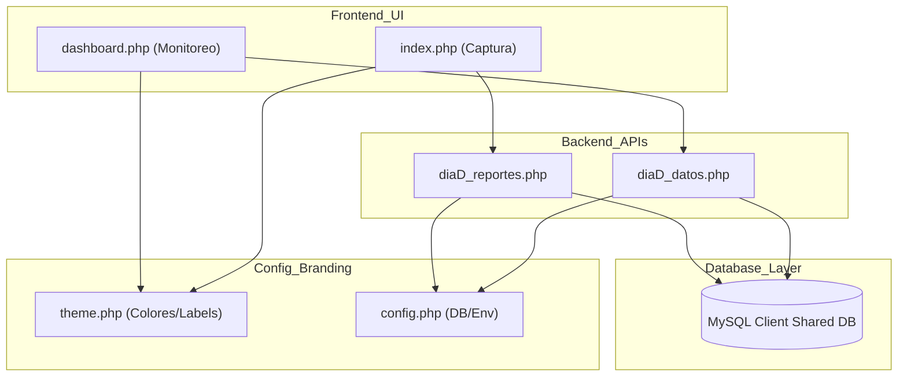
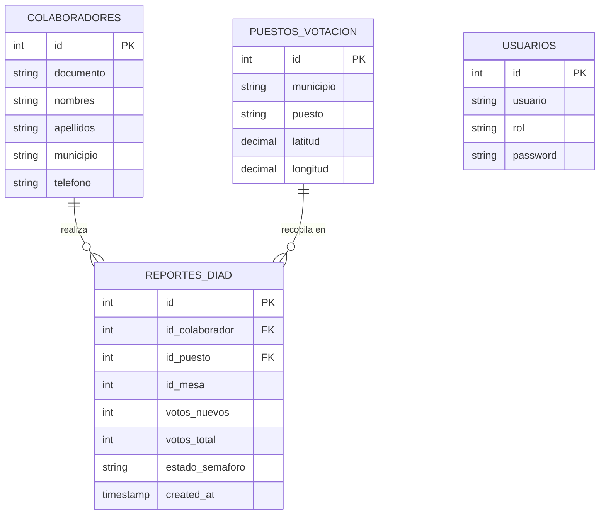
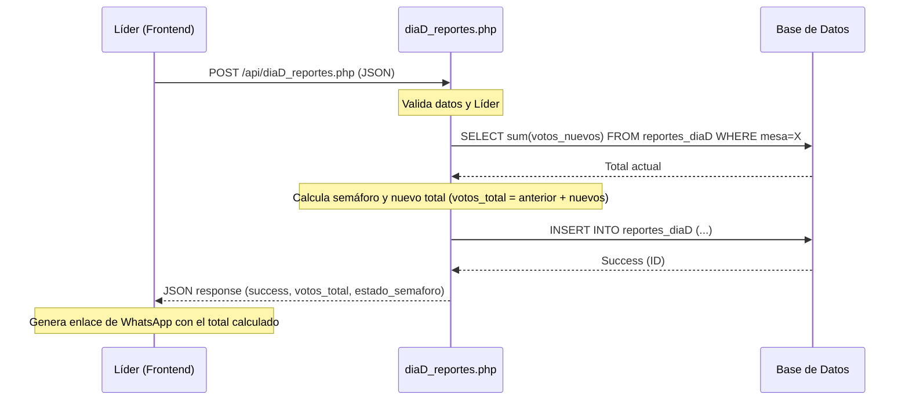

# Documentación Técnica - Módulo Día D (Standalone)

Esta documentación proporciona una visión técnica detallada de la arquitectura, base de datos y flujos del módulo **Día D**.

## 1. Arquitectura del Sistema

El módulo sigue una arquitectura monolítica ligera con una separación clara entre el backend (APIs en PHP) y el frontend (UI reactiva con Alpine.js/Tailwind).

### Diagrama de Arquitectura

---

## 2. Modelo de Datos (ERD)

El módulo requiere cuatro tablas principales para funcionar. Se asume una relación estrecha entre `colaboradores` y `reportes_diaD`.

---

## 3. Flujo de Reporte (Secuencia)

Este diagrama detalla cómo un líder envía un reporte desde el formulario de captura.

---

## 4. Sistema de Temas Dinámicos

El archivo `config/theme.php` centraliza la personalización visual. El sistema inyecta estas constantes directamente en:
- **Tailwind Config**: Colores `primary` y `secondary`.
- **CSS Gradients**: Fondos de los headers.
- **Labeling**: Nombres de la aplicación y el cliente.

---

## 5. Endpoints de API

### `diaD_datos.php?action=dashboard`
- **Uso**: Carga masiva de KPIs, estadísticas de puestos, municipios y rankings.
- **KPIs Incluidos**: Votos Totales, Puestos Reportados, Mesas Reportadas, Líderes Únicos.
- **Rankings**: Top 10 líderes por votos (`lideres_top`) y estadísticas por comuna (`comunas_stats`).
- **Autenticación**: Opcional (Modo Público habilitado según requerimiento).

### `diaD_datos.php?action=export`
- **Uso**: Generación y descarga de reporte detallado en formato Excel (XLSX).
- **Parámetros**: `id_campaña`.

### `diaD_reportes.php`
- **Uso**: Registro de nuevos votos.
- **Método**: POST.
- **Respuesta**: Incluye el estado del semáforo calculado dinámicamente y el total acumulado de la mesa.

---

## 6. Visualizaciones Especiales

### Mapa Geográfico (Leaflet)
- **Círculos Proporcionales**: El radio de los marcadores en el mapa se calcula dinámicamente basado en la cantidad de votos reportados en cada puesto.
- **Efecto Pulse**: Los marcadores incluyen una animación de pulsación para indicar actividad en vivo.

### Gráficos (Chart.js)
- **Ranking de Líderes**: Gráfico de barras horizontal que muestra la efectividad de los 10 líderes con más votos.
- **Votos por Comuna**: Visualización específica de la distribución de votos por comuna en el municipio de Yumbo.

### Matriz Territorial
- **Eje Dinámico**: Permite visualizar el cumplimiento de metas mesa por mesa.
- **Ordenamiento Estratégico**: Botón de alternancia para ordenar puestos alfabéticamente o por volumen de votos reportados, facilitando el análisis de prioridad.

---
© 2026 - Documentación Técnica Generada para Versión Standalone.
