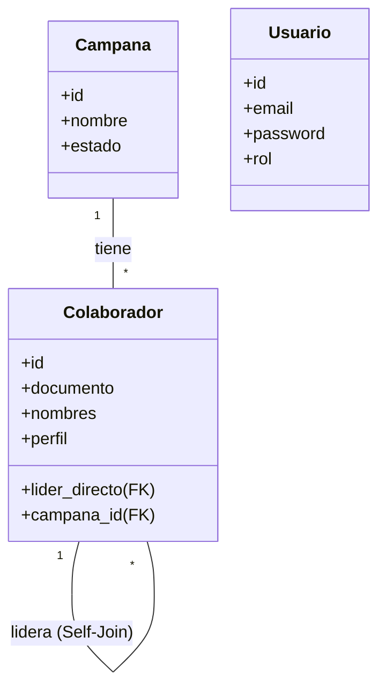

# C4 Code-Level Documentation
**Project:** Multi-Campaign Management System (Aratio)
**Module:** mod_colab (Collaborator Management)
**Date:** 2026-02-07

## Overview
This key module manages collaborators (`Colaborador`), their hierarchical relationships (Leader -> Followers), and their geographic and political data. It is built using a custom PHP MVC architecture.

## Code Elements

### Core Architecture (`src/Core`)

#### `App\Core\Router`
- **Purpose**: Handles URL routing and middleware execution.
- **Key Methods**:
  - `get($uri, $action, $middleware = [])`: Registers GET route.
  - `post($uri, $action, $middleware = [])`: Registers POST route.
  - `dispatch($uri, $method)`: Matches URI to route and executes controller action.
  - `addMiddleware($middleware)`: Adds global middleware.

#### `App\Core\Controller`
- **Purpose**: Base controller class providing common utilities.
- **Key Methods**:
  - `view($view, $data = [])`: Renders a view file.
  - `json($data)`: Returns JSON response.
  - `redirect($url)`: Redirects to URL.
  - `validate($data, $rules)`: Validates input data.

### Authentication & Middleware (`src/Middleware`)

#### `App\Middleware\AuthMiddleware`
- **Purpose**: Protects routes requiring authentication.
- **Key Methods**:
  - `handle()`: Checks `$_SESSION['user_id']`. Redirects to `/login` if missing.

#### `App\Middleware\RateLimitMiddleware`
- **Purpose**: Prevents abuse of public forms.
- **Key Methods**:
  - `limit($maxAttempts, $decaySeconds)`: Static factory for rate limiting.
  - `handle()`: Checks request count by IP in session/cache.

### Controllers (`src/Controllers`)

#### `App\Controllers\PublicController`
- **Purpose**: Handles public-facing forms (Registrations).
- **Location**: `src/Controllers/PublicController.php`
- **Dependencies**: `Colaborador`, `Curriculum`, `Database`
- **Key Methods**:
  - `showInscripcion()`: Displays the public leader registration form. Fetches active campaigns.
  - `storeInscripcion()`: Processes form submission. Creates `Colaborador` and links to Campaign and Leader.
  - `getLideresPorCampana()`: API endpoint returning JSON list of leaders for a given `campana_id`.

#### `App\Controllers\ColaboradorController`
- **Purpose**: Managed authenticated CRUD operations for collaborators.
- **Location**: `src/Controllers/ColaboradorController.php`
- **Key Methods**:
  - `index()`: Lists collaborators (paginated, filtered).
  - `create()` / `store()`: Admin creation of collaborators.
  - `network($id)`: Displays the hierarchical network of a leader.
  - `import()`: Handles bulk CSV import of collaborators.

#### `App\Controllers\AuthController`
- **Purpose**: Handles Login, Logout, and Password Reset.
- **Location**: `src/Controllers/AuthController.php`
- **Key Methods**:
  - `login()`: Validates credentials against `users` table.
  - `logout()`: Destroys session.

### Models (`src/Models`)

#### `App\Models\Colaborador`
- **Purpose**: Data access layer for `colaboradores` table.
- **Location**: `src/Models/Colaborador.php`
- **Key Properties**: `id`, `nombres`, `apellidos`, `documento`, `lider_directo`, `campana_id`.
- **Key Methods**:
  - `create($data)`: Inserts new collaborator.
  - `update($id, $data)`: Updates existing record.
  - `getLideresParaAsignar()`: Returns collaborators with 'Líder' profile.
  - `getByCampana($campanaId)`: Returns collaborators for a specific campaign.

#### `App\Models\Usuario`
- **Purpose**: Manages system users (Admins, Coordinators).
- **Location**: `src/Models/Usuario.php`
- **Key Methods**:
  - `findByEmail($email)`: Retrieves user by email for login.
  - `verifyPassword($password, $hash)`: Validates password.

### Utilities (`src/Utils`)

#### `App\Utils\Security`
- **Purpose**: Sanitization and security helpers.
- **Location**: `src/Utils/Security.php`
- **Key Methods**:
  - `sanitize($input)`: Cleans strings to prevent XSS.
  - `generateToken()`: Creates CSRF tokens.

#### `App\Utils\Validator`
- **Purpose**: Input validation library.
- **Location**: `src/Utils/Validator.php`
- **Key Methods**:
  - `required($fields)`: Checks presence.
  - `email($field)`: Validates email format.
  - `unique($field, $table, $column)`: Checks DB uniqueness.

## Database Schema (Key Relationships)

## Critical Flows

### Public Leader Registration (`/registro-lider`)
1. **User** accesses `PublicController@showInscripcion`.
2. **Controller** fetches active `Campanas` from DB.
3. **User** selects a Campaign.
4. **JS** calls `PublicController@getLideresPorCampana`.
5. **Controller** returns leaders for that campaign.
6. **User** fills form, selects Leader, submits.
7. **PublicController@storeInscripcion**:
   - Validates data.
   - Creates `Colaborador`.
   - Links to `campana_colaboradores` (if applicable).
   - Redirects to confirmation.
